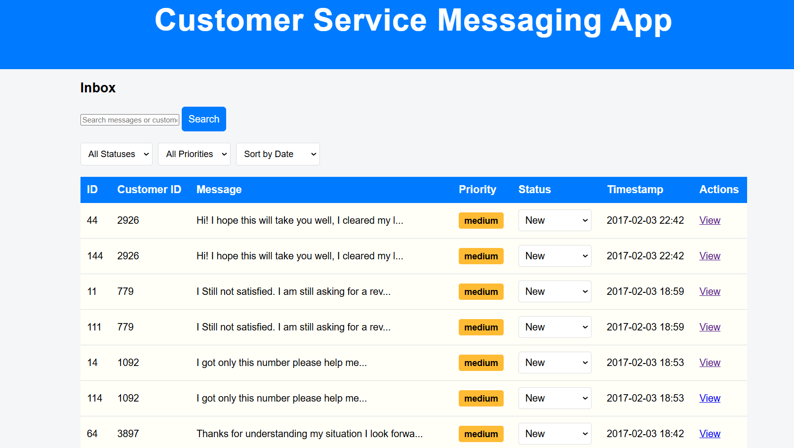
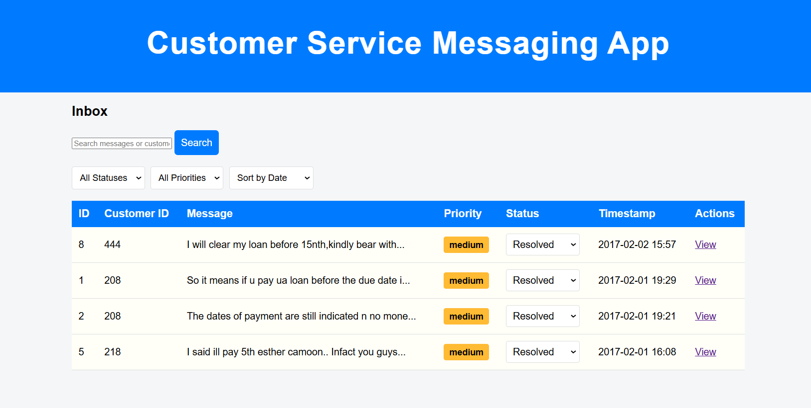
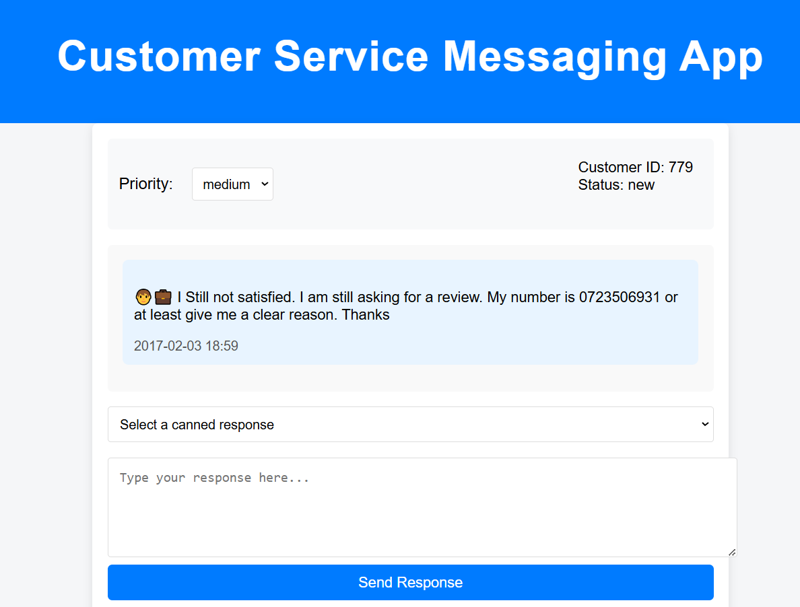
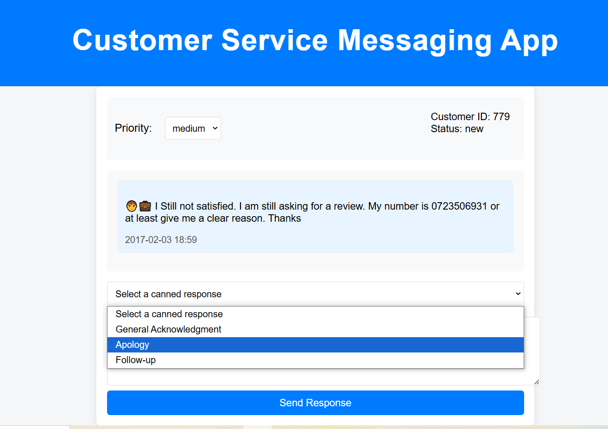
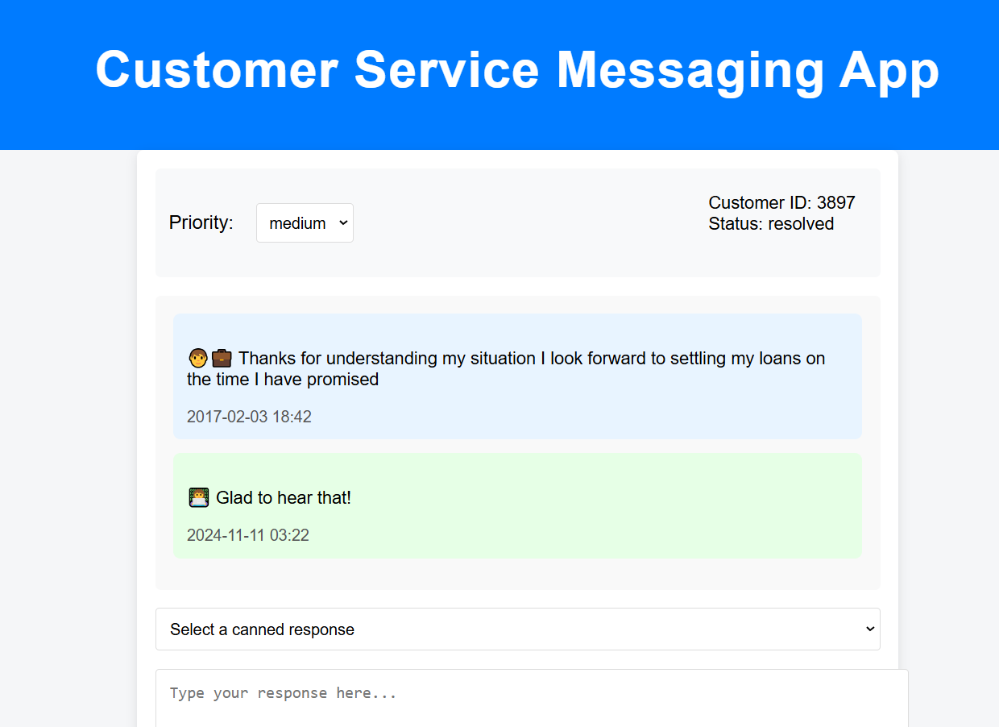
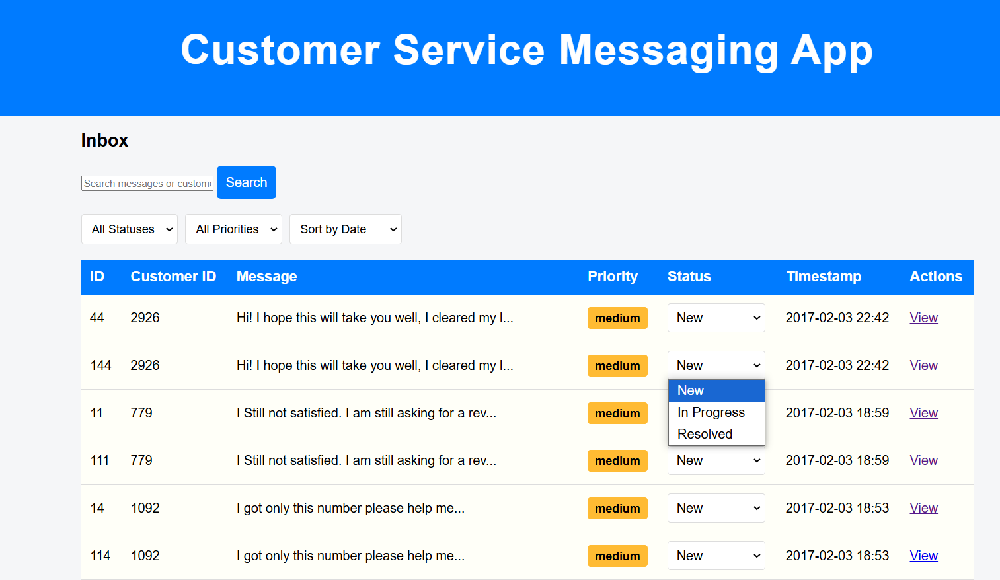

# Customer Service Messaging App

This project is a Customer Service Messaging application that allows support agents to manage and respond to customer inquiries efficiently. It offers features like message filtering, priority management, and status updates. Agents can quickly respond to messages using canned responses or custom replies, with real-time updates to the message statuses and priorities.

## Table of Contents
- [Overview](#Overview)
- [Features](#Features)
- [Technologies Used](#technologies-used)
- [Installation](#Installation)
- [Usage](#usage)
- [Prerequisites](#Prerequisites)
- [Additional Features](#additional-features)

# Overview

The **Customer Service Messaging App** is designed to streamline communication between customer support agents and customers. It provides a user-friendly interface for viewing, responding to, and organizing customer messages, allowing agents to manage customer interactions effectively.

# Key Features:
- **Message Inbox**: View and filter customer messages by status, priority, or timestamp.
- **Priority Management**: Change message priorities to reflect urgency.
- **Message Status**: Update message statuses (e.g., New, In Progress, Resolved).
- **Canned Responses**: Insert prewritten responses to save time and maintain consistency.
- **Message History**: View detailed conversations, including the customer's initial message and the agent's response.

# Features

- **Search Functionality**: Search for messages or customers using a simple search bar.
- **Filter Messages**: Apply filters based on message status, priority, and sorting order.
- **Status Dropdown**: Update the status of a message from 'New' to 'In Progress' or 'Resolved'.
- **Canned Response Dropdown**: Use predefined responses to quickly reply to common customer inquiries.
- **Real-time Updates**: Changes made to message status are reflected immediately in the system.

# Technologies Used

- **Frontend**:
  - HTML5
  - CSS3
  - JavaScript
  - Jinja2 (for templating)
  
- **Backend**:
  - Python
  - Flask (Web framework)
  - SQLAlchemy (ORM for database interaction)
  
- **Database**:
  - SQLite (for simplicity and quick setup)
  
- **Other Tools**:
  - Git (version control)
  - Virtualenv (to manage Python environments)

# Installation
-Before running the app, make sure you have the following installed on your machine:
  Python 3.7+
  pip (Python package installer)
  A text editor or IDE (e.g., VSCode, PyCharm)
# Prerequisites:
Before running the app, make sure you have the following installed on your machine:
- Python 3.7+
- pip (Python package installer)
- A text editor or IDE (e.g., VSCode, PyCharm)

### Steps to Install:

By following these steps, you'll be up and running with the application locally!   

1. **Clone the Repository**:
   ```bash
   git clone https://github.com/yourusername/customer-service-messaging-app.git
   cd customer-service-messaging-app
2. **Set Up a Virtual Environment**:
   ```bash
   python3 -m venv venv
3. **Activate the Virtual Environment**:
   - On Windows
   ```bash
   venv\Scripts\activate
4. **Install Dependencies**:
   - Install the required Python packages from the requirements.txt file.
   ```bash
   pip install -r requirements.txt
5. **Set Up the Database**:
   - The app uses SQLite for simplicity. Run the following command to set up the database:
   ```bash
   python models.py
6. **Import messages from CSV**:
   - Run the command:
   ```bash
   python import_messages.py
7. **Run the Application**:
   - Run the Application:
   ```bash
   python app.py


### Usage
Once the app is up and running, you can navigate to the following pages:

- Inbox: View all customer messages, filter by status and priority, and sort by timestamp.
- Message Detail: View individual messages, update their priority, and send a response.
- Search: Use the search bar to find messages or customers by their ID or message content.
- Update Status: Change the status of a message to reflect its current progress (New, In Progress, Resolved).  

### Additional Features

Following additional features are being implemented in the application-
  - Search functionality and to allow agents to search over incoming messages or customers
  - Canned message feature that allows agents to quickly respond to enquiries using a set of pre-configured stock messages
   
 # Customer Service Messaging App








  
   
